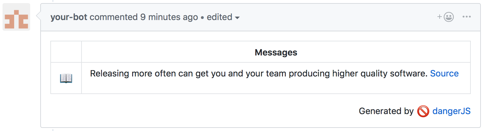

# danger-plugin-mentor

[](https://travis-ci.org/hanneskaeufler/danger-plugin-mentor)
[](https://badge.fury.io/js/danger-plugin-mentor)
[](https://github.com/semantic-release/semantic-release)
[](https://codeclimate.com/github/hanneskaeufler/danger-plugin-mentor/maintainability)
[](https://codeclimate.com/github/hanneskaeufler/danger-plugin-mentor/test_coverage) [](https://greenkeeper.io/)

> Level up your programming skills by getting bite-sized tips and tricks in your pull requests.

## Usage

Install:

```sh
yarn add danger-plugin-mentor --dev
```

At a glance:

```js
// dangerfile.js
import mentor from 'danger-plugin-mentor'

mentor()
```



You can specify an array of string tags to filter the shown tips:

```js
mentor(["testing", "agile"])
```

## Changelog

See the GitHub [release history](https://github.com/hanneskaeufler/danger-plugin-mentor/releases).

## Contributing

See [CONTRIBUTING.md](CONTRIBUTING.md).
